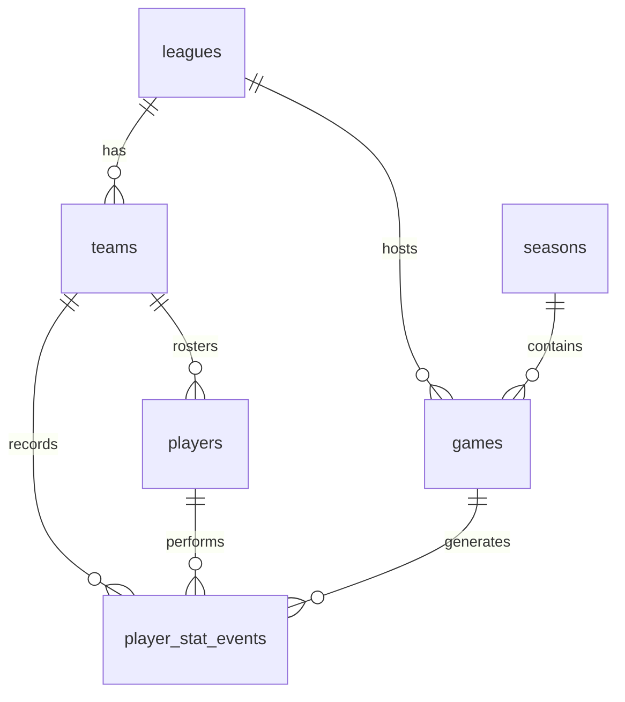

# Basketball Stats Tracking API

## Overview
This API provides real-time basketball statistics tracking for teams and players. It supports both live game stats and historical season averages.

## Application Components

1. **Live Stats Entry(Web Client for testing)**
   - Interactive form for entering real-time game statistics
   - Team and player selection dropdowns
   - Event type selection (points, assists, rebounds, etc.)
   - Value input based on event type
   - Game ID selection
   - Real-time WebSocket connection for instant updates

2. **Teams Statistics**
   - Comprehensive team performance metrics
   - Real-time updates of team statistics
   - Filtering capability by team name
   - Displays PPG, APG, RPG, SPG, BPG, TOPG, MPG, and Games played

3. **Players Statistics**
   - Detailed individual player statistics
   - Real-time updates of player performance
   - Advanced filtering by player name and team
   - Shows comprehensive stats including PPG, APG, RPG, SPG, BPG, TOPG, MPG, and Games played

## Data Flow

1. **Ingest Layer (WebSocket)**
   - Receives real-time game events
   - Handles live statistics updates
   - Maintains persistent WebSocket connection

2. **Processing Layer**
   - Redis Streams for event processing
   - Real-time data processing and caching
   - Efficient data distribution

3. **Storage Layer**
   - TimescaleDB for time-series data storage
   - Persistent storage of game statistics
   - Historical data management

4. **API Layer**
   - RESTful API endpoints for data retrieval
   - WebSocket endpoint for real-time updates
   - Swagger UI documentation available

## Development Setup

### Prerequisites
- Java 24 or higher
- Docker and Docker Compose
- Git installed
- Gardle installed(if you want to run from IDE)

### Running the Application
1. Start the database and Redis:
```bash
docker-compose up -d
```

2. Run the application:
```bash
./gradlew spring-boot:run
```

### Testing
Run the test suite:
```bash
./gradlew test
```

## Test page URL
```
Open `http://localhost:8082/` in your browser
   - Use the test interface to:
   - Connect/disconnect WebSocket
   - Send test events
   - Monitor connection status
   - View DB updates
```

Test page URL: http://localhost:8082/test.html

## Manual Testing Guide

### Testing WebSocket Connection

1. **Using the Test Page**
   - Open http://localhost:8082/test.html in your browser
   - Select a team from the dropdown
   - Select a player from the populated player dropdown
   - Choose an event type (points, assists, rebounds, etc.)
   - Select a value (e.g., 2 points, 3 points)
   - Click "Send Event" to send data through WebSocket

2. **Using WebSocket Client (e.g., Postman)**
   - Connect to WebSocket URL: `ws://localhost:8082/ws/game_live_update`
   - Send test event in JSON format:
   ```json
   {
     "team": "LAL",
     "player": "LeBron James",
     "event": "point",
     "value": 2,
     "gameId": "2024-03-20-LAL-GSW"
   }
   ```

### Testing REST API Endpoints

1. **Get Team Statistics**
   ```bash
   # Get all team stats
   curl http://localhost:8082/api/teams/stats

   # Get specific team stats
   curl http://localhost:8082/api/teams/stats?team=LAL
   ```

2. **Get Player Statistics**
   ```bash
   # Get all player stats
   curl http://localhost:8082/api/players/stats

   # Get specific player stats
   curl http://localhost:8082/api/players/stats?player=LeBron%20James

   # Get player stats for specific team
   curl http://localhost:8082/api/players/stats?team=LAL
   ```

3. **Get Game Statistics**
   ```bash
   # Get stats for specific game
   curl http://localhost:8082/api/games/stats?gameId=2024-03-20-LAL-GSW
   ```

## Verifying Data Updates
After sending a WebSocket event, you can verify the data was properly recorded by checking these endpoints:

### 1. Check Team Stats
```bash
curl http://localhost:8082/api/teams/stats?team=1
```
- Look for updated statistics in the response
- Verify the event type (points, assists, etc.) is reflected in the totals
- Check if PPG, APG, RPG, etc. are updated correctly

### 2. Check Player Stats
```bash
curl http://localhost:8082/api/players/stats?player=1
```
- Verify the player's individual statistics are updated
- Check if the event is reflected in the player's totals
- Confirm the player's team affiliation is correct

### 3. Check Game Stats
```bash
curl http://localhost:8082/api/games/stats?gameId=1
```
- Verify the game's event history includes your recent event
- Check if team and player stats for this game are updated
- Confirm the game details are correct

## Expected Results

1. **WebSocket Test**
   - After sending an event, you should see:
     - Real-time updates in the Teams and Players statistics tables
     - Updated values for the specific event type
     - Changes reflected in both team and player statistics

2. **REST API Test**
   - Team stats should show:
     - PPG, APG, RPG, SPG, BPG, TOPG, MPG
     - Total games played
     - All values should be non-negative
   - Player stats should show:
     - Individual player performance metrics
     - Team affiliation
     - Games played
   - Game stats should show:
     - Team and player performance for the specific game
     - Event history for the game

### Troubleshooting

1. **WebSocket Issues**
   - Check if the WebSocket connection is established (browser console)
   - Verify the event format matches the expected schema
   - Ensure all required fields are present in the event

2. **REST API Issues**
   - Verify the server is running on port 8082
   - Check if the database connection is active
   - Ensure proper URL encoding for parameters with spaces

## Authentication
Currently, the API does not require authentication.

## Endpoints

### Teams

#### Get Team Stats
```http
GET /teams/{teamId}/stats?seasonId={seasonId}
```

Retrieves average statistics for a specific team in a given season.

**Parameters:**
- `teamId` (path) - The unique identifier of the team
- `seasonId` (query) - The season identifier (required)

**Response Format:**
```json
{
    "teamId": "1",
    "seasonId": "1",
    "games": 10,
    "ppg": 105.5,    // Points per game
    "apg": 24.3,     // Assists per game
    "rpg": 42.1,     // Rebounds per game
    "spg": 8.7,      // Steals per game
    "bpg": 5.2,      // Blocks per game
    "topg": 13.8,    // Turnovers per game
    "mpg": 240.0     // Minutes per game
}
```

**Status Codes:**
- 200: Success
- 404: Team not found
- 400: Invalid request (missing seasonId)
- 500: Server error

### Players

#### Get Player Stats
```http
GET /players/{playerId}/stats?seasonId={seasonId}
```

Retrieves average statistics for a specific player in a given season.

**Parameters:**
- `playerId` (path) - The unique identifier of the player
- `seasonId` (query) - The season identifier (required)

**Response Format:**
```json
{
    "playerId": "1",
    "seasonId": "1",
    "teamId": "1",
    "games": 10,
    "ppg": 27.5,     // Points per game
    "apg": 9.0,      // Assists per game
    "rpg": 7.0,      // Rebounds per game
    "spg": 1.5,      // Steals per game
    "bpg": 1.5,      // Blocks per game
    "topg": 2.5,     // Turnovers per game
    "mpg": 31.5      // Minutes per game
}
```

**Status Codes:**
- 200: Success
- 404: Player not found
- 400: Invalid request (missing seasonId)
- 500: Server error

### WebSocket Events

The API also supports real-time updates via WebSocket connection.

#### Connection URL
```
ws://localhost:8082/ws/game_live_update
```

#### Message Format
All messages should follow this general structure:
```json
{
    "gameId": "1",             // String: Simple numeric ID (e.g., "1", "2", "3")
    "teamId": "1",             // String: Simple numeric ID (e.g., "1", "2", "3")
    "playerId": "1",           // String: Simple numeric ID (e.g., "1", "2", "3")
    "event": "point",          // String: Event type
    "value": 3                 // Number: Event value
}
```

Available events (all string values):
- `point` (value: 2 or 3)
- `assist` (value: 1)
- `rebound` (value: 1)
- `steal` (value: 1)
- `block` (value: 1)
- `turnover` (value: 1)
- `minutes` (value: 0-48)

#### Response Messages
The server will respond with success/error messages in this format:
```json
{
    "status": "success",
    "message": "Event recorded successfully",
    "timestamp": "2024-03-01T19:30:00Z"
}
```

or for errors:
```json
{
    "status": "error",
    "message": "Invalid event type",
    "timestamp": "2024-03-01T19:30:00Z"
}
```

## Data Models

### Team Stats
| Field    | Type    | Description           |
|----------|---------|-----------------------|
| teamId   | string  | Team identifier       |
| seasonId | string  | Season identifier     |
| games    | integer | Games played          |
| ppg      | double  | Points per game       |
| apg      | double  | Assists per game      |
| rpg      | double  | Rebounds per game     |
| spg      | double  | Steals per game       |
| bpg      | double  | Blocks per game       |
| topg     | double  | Turnovers per game    |
| mpg      | double  | Minutes per game      |

### Player Stats
| Field    | Type    | Description           |
|----------|---------|-----------------------|
| playerId | string  | Player identifier     |
| teamId   | string  | Team identifier       |
| seasonId | string  | Season identifier     |
| games    | integer | Games played          |
| ppg      | double  | Points per game       |
| apg      | double  | Assists per game      |
| rpg      | double  | Rebounds per game     |
| spg      | double  | Steals per game       |
| bpg      | double  | Blocks per game       |
| topg     | double  | Turnovers per game    |
| mpg      | double  | Minutes per game      |

## Error Responses

When an error occurs, the API will return a JSON response with an error message:

```json
{
    "error": "Error message here",
    "status": 404,
    "timestamp": "2024-01-20T12:34:56.789Z"
}
```

## Rate Limiting
Currently, there are no rate limits implemented.

## Caching
The API uses Redis caching

## Database Schema

The application uses TimescaleDB (PostgreSQL extension) for time-series data management. Here's the database schema:

### Core Tables

#### leagues
| Column     | Type      | Description                |
|------------|-----------|----------------------------|
| league_id  | TEXT      | Primary Key               |
| name       | TEXT      | League name               |
| country    | TEXT      | Country of the league     |
| created_at | TIMESTAMP | Creation timestamp        |

#### seasons
| Column     | Type      | Description                |
|------------|-----------|----------------------------|
| season_id  | TEXT      | Primary Key               |
| name       | TEXT      | Season name               |
| start_date | DATE      | Season start date         |
| end_date   | DATE      | Season end date           |
| active     | BOOLEAN   | Is current season         |
| created_at | TIMESTAMP | Creation timestamp        |

#### teams
| Column        | Type      | Description                |
|---------------|-----------|----------------------------|
| team_id       | TEXT      | Primary Key               |
| name          | TEXT      | Team name                 |
| league_id     | TEXT      | Foreign Key to leagues    |
| country       | TEXT      | Team's country            |
| city          | TEXT      | Team's city               |
| division      | TEXT      | Division                  |
| conference    | TEXT      | Conference                |
| arena         | TEXT      | Home arena                |
| founded_year  | INTEGER   | Year founded              |
| created_at    | TIMESTAMP | Creation timestamp        |
| last_updated  | TIMESTAMP | Last update timestamp     |

#### players
| Column        | Type      | Description                |
|---------------|-----------|----------------------------|
| player_id     | TEXT      | Primary Key               |
| name          | TEXT      | Player name               |
| team_id       | TEXT      | Foreign Key to teams      |
| jersey_number | TEXT      | Jersey number             |
| position      | TEXT      | Playing position          |
| active        | BOOLEAN   | Is active player          |
| created_at    | TIMESTAMP | Creation timestamp        |
| last_updated  | TIMESTAMP | Last update timestamp     |

#### games
| Column        | Type      | Description                |
|---------------|-----------|----------------------------|
| game_id       | TEXT      | Primary Key               |
| game_date     | DATE      | Game date                 |
| season_id     | TEXT      | Foreign Key to seasons    |
| league_id     | TEXT      | Foreign Key to leagues    |
| home_team_id  | TEXT      | Foreign Key to teams      |
| away_team_id  | TEXT      | Foreign Key to teams      |
| start_time    | TIME      | Game start time           |
| state         | TEXT      | Game state                |
| created_at    | TIMESTAMP | Creation timestamp        |
| last_updated  | TIMESTAMP | Last update timestamp     |

### Time-Series Tables

#### player_stat_events (Hypertable)
| Column      | Type      | Description                |
|-------------|-----------|----------------------------|
| event_id    | SERIAL    | Event identifier          |
| player_id   | TEXT      | Foreign Key to players    |
| game_id     | TEXT      | Foreign Key to games      |
| team_id     | TEXT      | Foreign Key to teams      |
| season_id   | TEXT      | Season identifier         |
| stat_type   | TEXT      | Type of stat              |
| stat_value  | NUMERIC   | Stat value                |
| version     | BIGINT    | Event version             |
| created_at  | TIMESTAMP | Event timestamp (partition)|

Valid stat types: point, assist, rebound, steal, block, foul, turnover, minutes_played

### Materialized Views

#### team_avg_stats_view_per_bucket
Continuous aggregation of team statistics per day, including:
- Games played
- Total points, assists, rebounds, steals, blocks, turnovers
- Minutes played
- Updates every 10 minutes

#### player_avg_stats_view_per_bucket
Continuous aggregation of player statistics per day, similar to team stats
- Updates every 10 minutes

### Regular Views

#### team_avg_stats_view
Calculates per-game averages for teams from the bucketed view:
- Points per game (ppg)
- Assists per game (apg)
- Rebounds per game (rpg)
- Other per-game statistics

#### player_avg_stats_view
Calculates per-game averages for players from the bucketed view:
- Points per game (ppg)
- Assists per game (apg)
- Rebounds per game (rpg)
- Other per-game statistics

### Relationships


### Indexes
- player_stat_events: game_id, player_id, stat_type
- games: season_id, league_id
- players: team_id
- teams: league_id

